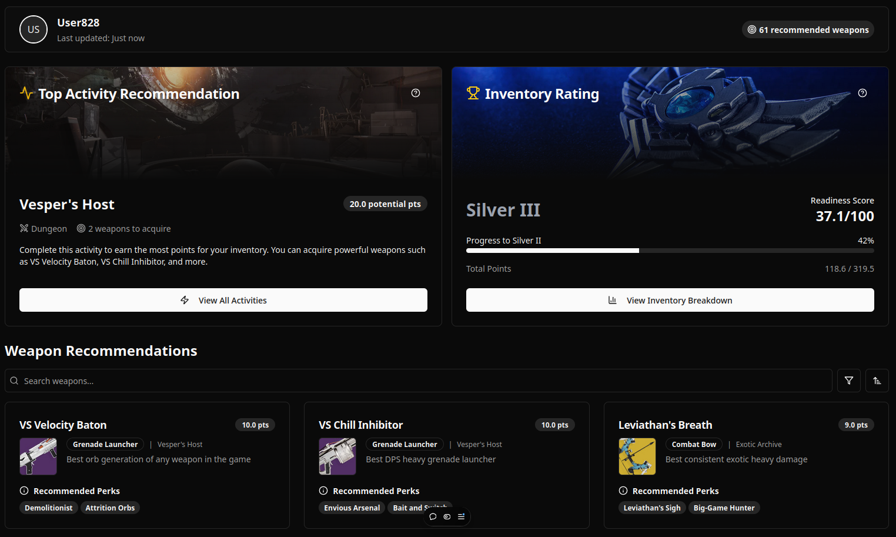
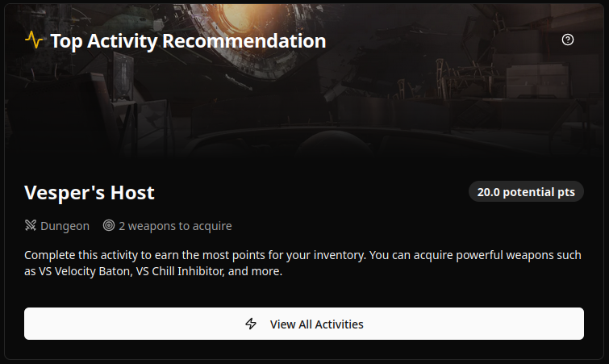
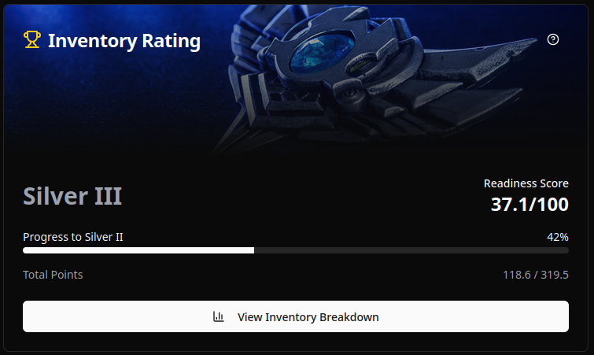
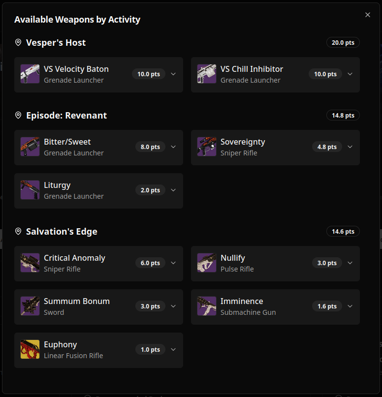
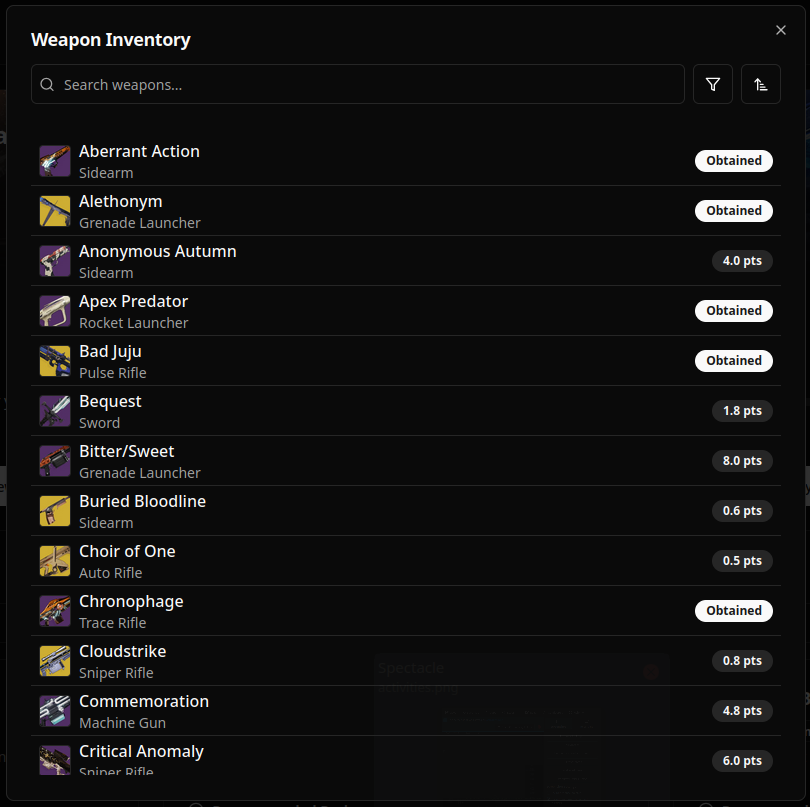

# D2Loot: Destiny 2 Inventory Optimization Tool

## 🌟 [Check out D2Loot in action!](https://d2loot.com) 🌟

D2Loot is a cutting-edge web application designed to revolutionize inventory management for Destiny 2 players. By leveraging advanced algorithms and real-time data analysis, D2Loot provides personalized weapon recommendations, activity suggestions, and comprehensive inventory insights to help Guardians optimize their arsenal for any challenge.



## 🚀 Features

- **Inventory Rating**: Get a detailed analysis of your weapon collection's strengths and areas for improvement.
- **Top Recommendations**: Discover the best weapons to pursue based on your playstyle and current inventory.
- **Activity Suggestions**: Receive personalized recommendations for activities that will most efficiently improve your arsenal.
- **Real-time Sync**: Seamless integration with Bungie's API for up-to-date inventory information.
- **User-friendly Interface**: Intuitive design for easy navigation and quick access to vital information.
- **Responsive Design**: Fully functional on both desktop and mobile devices.

## 🛠️ Technology Stack

- **Frontend**: React, TypeScript, Tailwind CSS
- **Backend**: Go
- **Database**: Turso SQLite
- **Authentication**: OAuth 2.0 with Bungie.net
- **API Integration**: Bungie API
- **Deployment**: Docker, Vercel, Koyeb

## 🔧 Installation and Setup

1. Set up a workspace directory:
```
This app uses concurrently to run the frontend and backend in the same terminal.
Clone both the frontend and backend repository into this folder
```

2. Clone the repositories:
```
cd workspace
git clone https://github.com/AdamarArcane/d2-loot-frontend
git clone https://github.com/AdamarArcane/d2-loot-backend
```

3. Set up the frontend:
```
cd d2-loot-frontend
npm install
```

4. Set up the backend:
```
cd ../d2-loot-backend
go mod tidy
```

5. Create your app on the [Bungie dev site](https://bungie.net/en/application) for OAuth2:
```
Both of your ports need to serve over an HTTPS connection for Bungie authentication.
The frontend is taken care of for you with makecert but you will need to figure out the backend.
I used [Ngrok](https://ngrok.com/)!
Your app should be set to private with private authentication.
Make sure that your callback link exactly matches your backend link (could be ngrok).
```

6. Set up enviorment variables (create your own .env file):
```
// frontend
VITE_FRONTEND_URL=https://localhost:5173
VITE_BACKEND_URL=
```
```
// backend
PORT="8080"
FRONTEND_DOMAIN="localhost:5173"
BACKEND_DOMAIN=
DATABASE_URL=
CLIENT_ID=
CLIENT_SECRET=
REDIRECT_URL=
SESSION_KEY=
ENCRYPTION_KEY =
API_KEY=
```

7. Start the development server:
```
cd d2-loot-frontend
npm run start
```

8. Open `https://localhost:5173` in your browser.

## 📸 Screenshots

<div align="center">
  
  
  
  
</div>

## 🤝 Contributing

Contributions, issues, and feature requests are welcome! Feel free to check the [issues page](https://github.com/AdamarArcane/d2-loot-frontend/issues).

## 📝 License

This project is [MIT](https://choosealicense.com/licenses/mit/) licensed.

## 👨‍💻 About the Developer

Hi, I'm John, a passionate full-stack developer with a love for gaming and creating tools that enhance the gaming experience. D2Loot is a testament to my skills in modern web development, API integration, and user-centric design. My expertise spans from React and TypeScript on the frontend to Go on the backend, showcasing my versatility in both JavaScript and compiled languages.

🔗 [LinkedIn](https://www.linkedin.com/in/yourusername) | 🐦 [Twitter](https://twitter.com/yourusername)

---

⭐️ If you find D2Loot helpful, consider giving it a star on GitHub! ⭐️


